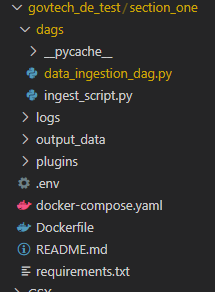
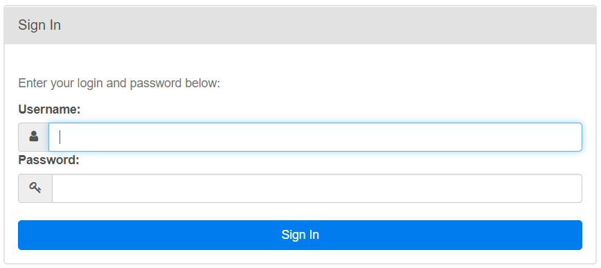
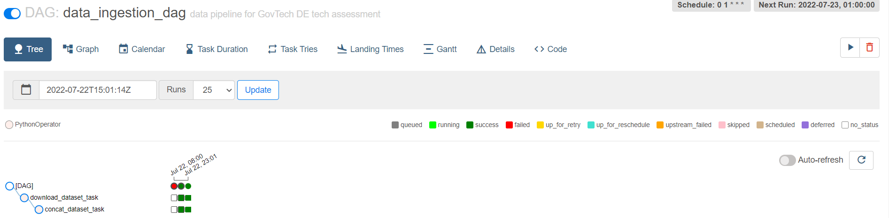
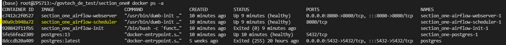

### Section One of GovTech Data Engineer Tech Challenge
The objective of this section is to design and implement a solution to process a data file on a regular interval (e.g. daily). Assume that there are 2 data files dataset1.csv and dataset2.csv, design a solution to process these files, along with the scheduling component. The expected output of the processing task is a CSV file including a header containing the field names.

You can use common scheduling solutions such as cron or airflow to implement the scheduling component. You may assume that the data file will be available at 1am everyday. Please provide documentation (a markdown file will help) to explain your solution.

Processing tasks:

- Split the name field into first_name, and last_name
- Remove any zeros prepended to the price field
- Delete any rows which do not have a name
- Create a new field named above_100, which is true if the price is strictly greater than 100

**output of the processed dataset is in output_data/dataset_staging.csv**

### Project Strucutre



- **dags** folder stores all the  Airflow DAG's. The ETL steps are defined in **ingest_script.py**. The DAG is defined in the **data_ingestion_dag.py**.
- **ouput_data** folder stores the processed dataset: **dataset_staging.csv**
- **docker-compose.yml** defines the services that will be created in the docker container.
- **Dockerfile** defines the commands that will be run when building the required docker images.

### Execution

1. Build the image (only first-time, or when there's any change in the `Dockerfile`):
```shell
docker-compose build
```

2. Kick up the all the services from the container:
```shell
docker-compose up
```

3. Login to Airflow web UI on `localhost:8080` with username: `airflow` and password: `airflow`



4. Run the DAG ()



5. Check the docker container id where we store the dataset output

```shell
docker ps -a
```



Take note of the CONTAINER_ID of the **section_one_airflow-init** container, which will be used in the next step.

<br>

6. Copy the processed dataset output from the docker container to the local machine

Copy paste the CONTAINER_ID from the previous step to the command below.

```shell
docker cp <CONTAINER_ID>:opt/airflow/dataset_staging.csv ~/govtech_de_test/section_one/output_data
```

For more info, check out these official docs:
   * https://airflow.apache.org/docs/apache-airflow/stable/start/docker.html
   * https://airflow.apache.org/docs/docker-stack/build.html
   * https://airflow.apache.org/docs/docker-stack/recipes.html
   

### Future Enhancements
* Deploy self-hosted Airflow setup on Kubernetes cluster, or use a Managed Airflow (Cloud Composer) service by GCP
