### Section Two of GovTech Data Engineer Tech Challenge
You are appointed by a car dealership to create their database infrastructure. There is only one store. In each business day, cars are being sold by a team of salespersons. Each transaction would contain information on the date and time of transaction, customer transacted with, and the car that was sold.

The following are known:

- Each car can only be sold by one salesperson.
- There are multiple manufacturers’ cars sold.
- Each car has the following characteristics:
- Manufacturer
- Model name
- Serial number
- Weight
- Price

Each sale transaction contains the following information:

- Customer Name
- Customer Phone
- Salesperson
- Characteristics of car sold

Set up a PostgreSQL database using the base docker image here given the above. We expect at least a Dockerfile which will stand up your database with the DDL statements to create the necessary tables. Produce entity-relationship diagrams as necessary to illustrate your design.

Your team also needs you to query some information from the database that you have designed. Note that the business requirements for the database is not limited to the 2 queries below, do design your database to account a wide range of business use cases. 

You are tasked to write a sql statement for each of the following task:
- I want to know the list of our customers and their spending.
- I want to find out the top 3 car manufacturers that customers bought by sales (quantity) and the sales number for it in the current month.

### Project Structure

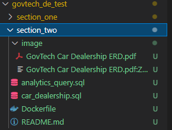

- **analytics_query.sql** contains the analytics query to answer the two tasks in the problem statement mentioned above.
- **car_dealership.sql** contains the DDL statement to initialize and load all the required tables.
- **Dockerfile** contains the statement for building the postgresql docker image
- **image/Govtech Car Dealership ERD.pdf** is the entity-relationship diagram for the car dealership database

### Entity Relationship Diagram

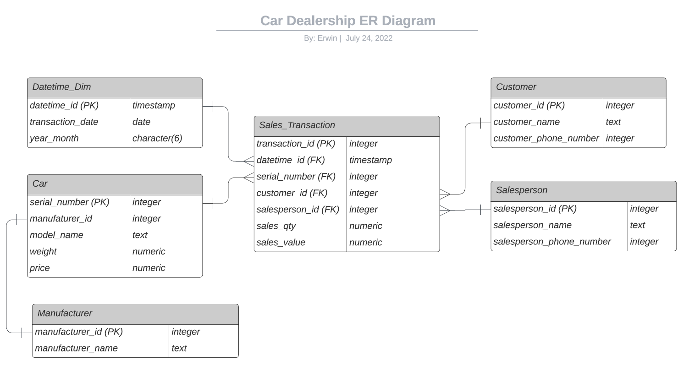

### Execution

1. Build the postgresql docker image:

```shell
docker build -t govtech-test-db ./
```

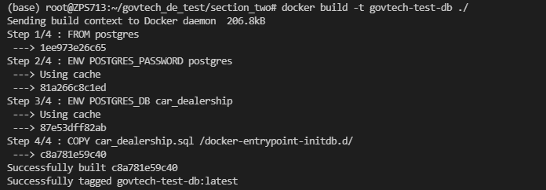

2. Create and run the postgresql docker container using the docker image built in step 1:

```shell
docker run -d --name govtech-test-db-container -p 5432:5432 govtech-test-db
```

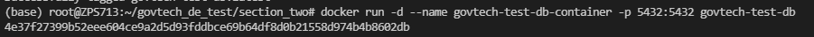

3. Find the postgresql container id and make sure the status is up and running

```shell
docker ps -a
```

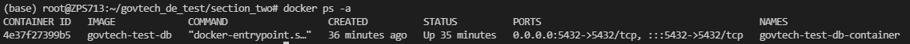

4. Go into postgreqsl docker container

```shell
docker exec -it <container_id> bash
```

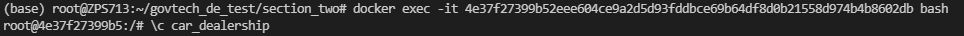

5. Check that the database and tables are successfully created

- Go into psql command line mode

```shell
psql -U postgresql
```

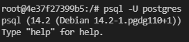


- check the list of databases created

```shell
\l
```

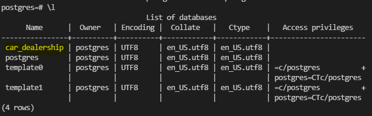

- Connect to car_dealership database

```shell
\c car_dealership
```

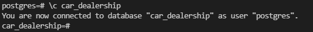

- check the list of tables created

```shell
\dt
```


6. Check the analytics query that answers the questions in the problem statement

- Query 1 result

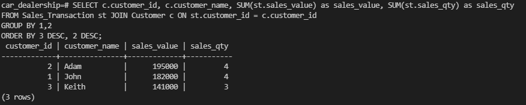

- Query 2 result

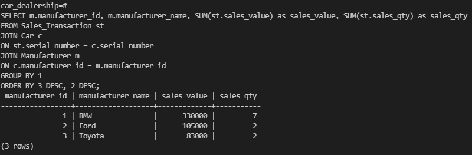