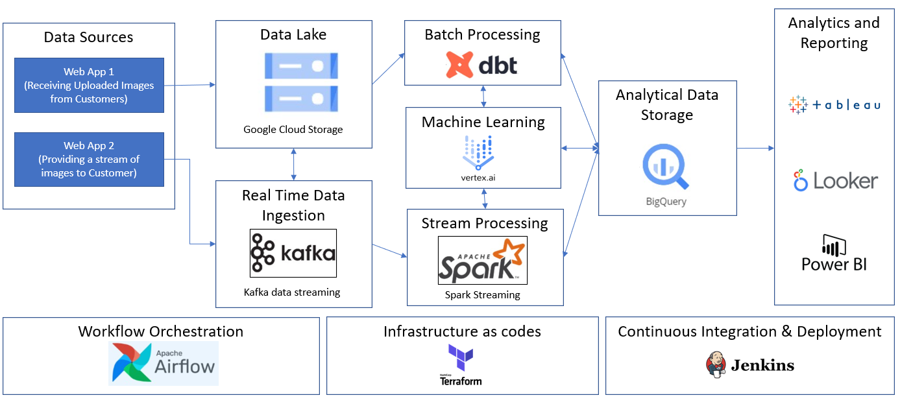

### Section Three of GovTech Data Engineer Tech Challenge
Prepare a presentation to your project team on how you plan to design data infrastructure on the cloud for a company whose main business is in processing images. Your role is the Tech Lead for this project.

The company has a web application which collects images uploaded by customers. The company also has a separate web application which provides a stream of images using a Kafka stream. The company’s software engineers have already some code written to process the images.

The company would like to save processed images for a minimum of 7 days for archival purposes. Ideally, the company would also want to be able to have some Business Intelligence (BI) on key statistics including number and type of images processed, and by which customers.

Produce a system architecture diagram (e.g. Visio, Powerpoint) using any of the commercial cloud providers' ecosystem to explain your design. Please also indicate clearly if you have made any assumptions at any point.

Share about the pros and cons of your design to justify the decisions you have made.

### System Architecture Diagram

- There are two data sources: uploaded images from customers and stream of images provided by the company's web app.
- In both scenarios, the data sources are stored in the company's data lake (Google Cloud Storage), so that it can cater to the **minimum of 7 days for archival purposes**
- To provide image streaming to the customer, the company can choose to use Kafka as a data stream provider.
- The data streaming pocess can be further optimized with Spark Streaming to enable distributed processing to the machine learning platform (vertex.ai) for image processing.
- Separately, the data stored in the Google Cloud Storage can also be transformed in batch through DBT by connecting to the BigQuery Data Warehouse.
- After the data is cleaned in the BigQuery, the company can connect their Analytics/ Reporting tools (e.g. Tableau/Looker/PowerBI) to the BigQuery for generating business reports.
- To orchestrate/schedule the entire data process mentioned above, the company can use Apache Airflow.
- Other best practices can also include using Terraform to help with infrastructure deployment.
- In addition, the engineering team can also use Jenkins for continuous integration and deployment to ensure the ELT scripts/Machine Learning models are properly tested before deployment.

### Pros of the Proposed Solution

- Various data formats can be safely archived for a long period of time in the data lake (Google Cloud Storage).
- The proposed data architecture cater to both batch processing (business reporting) and streaming process (streaming image) that are relevant to company's use cases in the problem statement.
- In case the company needs to switch data tools, it is relatively flexible to migrate the tools because the data architecture are separated into different components that are covered by different tools/vendors.
- In addition, the data infrastructure upgrade/migration can be configured in Terraform to provide a more efficient infrastructure upgrade/migration process.

### Cons of the Proposed Solution

- The data lake (Google Cloud Storage) might store enormous amount of useless data that are consolidated but not archived timely.
- It might incur huge cost chargeable by the cloud provider if the data processing operation is not optimized, e.g. 
- It might be a bit more challenging to build a data team (e.g. data analyst/ data engineer/ ML engineer/ data scientist), that is well versed tp work with the multiple tools in various components of the data architecture.