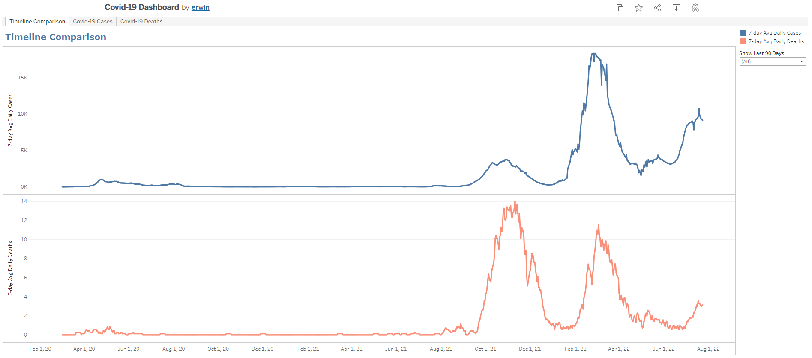
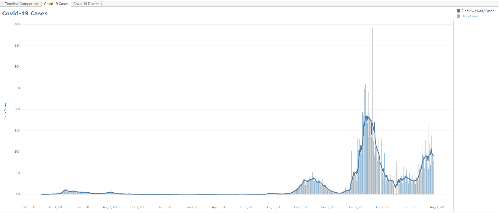
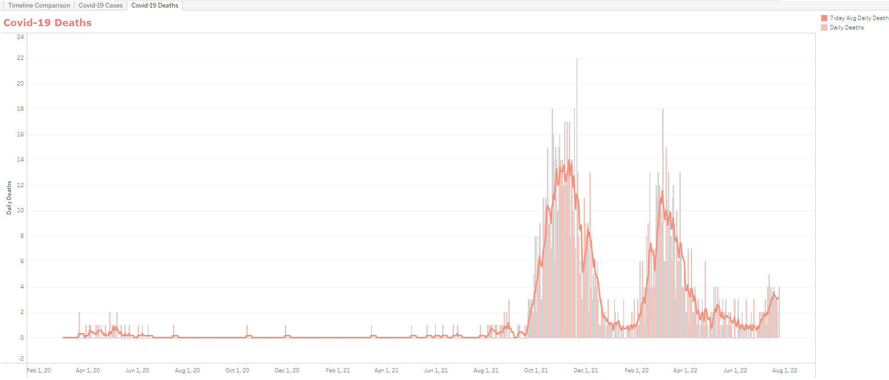

### Section Four of GovTech Data Engineer Tech Challenge
Your team decided to design a dashboard to display the statistic of COVID19 cases. You are tasked to display one of the components of the dashboard which is to display a visualisation representation of number of COVID19 cases in Singapore over time.

Your team decided to use the public data from https://documenter.getpostman.com/view/10808728/SzS8rjbc#b07f97ba-24f4-4ebe-ad71-97fa35f3b683.

Display a graph to show the number cases in Singapore over time using the APIs from https://covid19api.com/.

Note: please submit screenshots of the dashboard

### Covid-19 Dashboard

The Covid-19 dataset is retrieved via python script (**download_covid_data.py**) to **data/covid_sg.csv** and then uploaded to Tableau Public to visualize the data.

The Covid-19 Dashboard can be accessed from: https://public.tableau.com/app/profile/erwin5712/viz/Covid-19Dashboard_16586442636000/TimelineComparison

There are three sections of the dashboard:
1. Timeline Comparison

- This section is to compare 7-day average of daily cases and 7-day average of daily deaths
- We can also filter to see the last 90 days of data

2. Covid-19 Cases

- This section shows the daily cases and 7-day average daily cases.

2. Covid-19 Deaths

- This section shows the daily deaths and 7-day average daily deaths.

