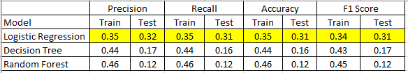
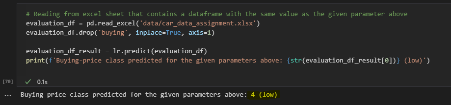

### Section Five of GovTech Data Engineer Tech Challenge
Using the dataset from https://archive.ics.uci.edu/ml/datasets/Car+Evaluation, create a machine learning model to predict the buying price given the following parameters:

- Maintenance = High
- Number of doors = 4
- Lug Boot Size = Big
- Safety = High
- Class Value = Good

### Machine Learning Model Summary

The working file for this section is in **car_evaluation.ipynb**

#### Model Evaluation Summary

After running various predictive models, we are able to see the performance of each models summarized below.
 
As shown in the table below, both Decision Tree and Random Forest seem to be overfitting based on the scores in the Train vs Test dataset.
 
As such, we will pick the logistic regression because it performs the best as compared to the other two models.
 
However, the model performance is still low, so there is an opportunity to further fine tune the model.

#### Predicting the Buying Class with the Given Parameters Above

Now, we are going to predict the buying-price class with the following parameters:
- Maintenance = High --> encoded into 1
- Number of doors = 4 --> encoded into 3
- Lug Boot Size = Big --> encoded into 3
- Safety = High --> encoded into 3
- Class Value = Good --> encoded into 4

